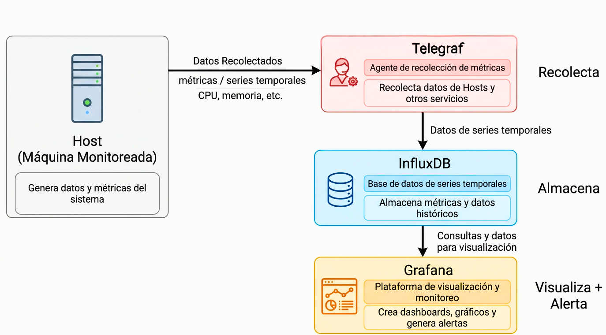
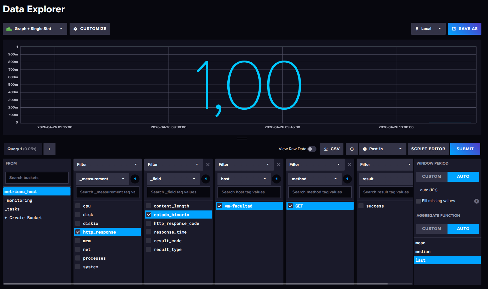
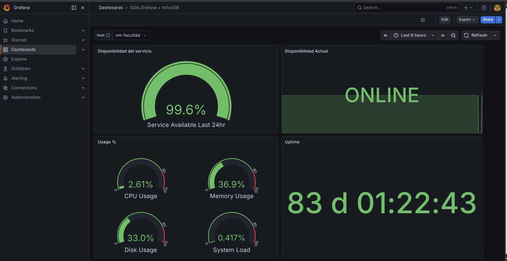

# Grupo 1: Telegraf + InfluxDB 2.8
## Sistema de recolección y almacenamiento de métricas

> **Materia:** Arquitectura Orientada a Servicios                
> **Tecnologías:** Telegraf 1.38 · InfluxDB 2.8 · Docker Compose                
> **Rol en el TP integrado:** Recolección de métricas del host y almacenamiento en series temporales para consumo del Grupo 2 (Grafana)               

---

## Índice

1. [¿Qué hace este proyecto?](#qué-hace-este-proyecto)
2. [Instalación y configuración](#instalación-y-configuración)
3. [Estructura del proyecto](#estructura-del-proyecto)
4. [Variables de entorno](#variables-de-entorno)
5. [Credenciales y seguridad](#credenciales-y-seguridad)
6. [Decisiones de diseño](#decisiones-de-diseño)
7. [Buenas prácticas técnicas](#buenas-prácticas-técnicas)
8. [Métricas recolectadas](#métricas-recolectadas)
9. [Estado on/off de servicios](#estado-onoff-de-servicios)
10. [Comandos útiles](#comandos-útiles)
11. [Resultados, pruebas y evidencias](#resultados-pruebas-y-evidencias)
12. [Problemas encontrados y soluciones](#problemas-encontrados-y-soluciones)

---

## ¿Qué hace este proyecto?

Este repositorio implementa la capa de **recolección y almacenamiento** del sistema de observabilidad del TP integrado. El flujo es el siguiente:

<!-- ```
[Sistema Operativo del Host]
         │
         │  Telegraf lee /proc y /sys cada 10 segundos
         ▼
    [ Telegraf ]
         │
         │  Escribe via HTTP usando InfluxDB Line Protocol
         ▼
   [ InfluxDB 2.8 ]
         │
         │  El Grupo 2 (Grafana) se conecta desde acá
         ▼
    [ Grafana ]
``` -->



Telegraf recolecta métricas de CPU, memoria, disco, red, carga del sistema y procesos, y las almacena como series temporales (una secuencia de valores medidos a lo largo del tiempo) en InfluxDB, organizadas por host.

---

## Instalación y configuración

### Requisitos y dependencias

El único requisito para correr este proyecto es **Docker con Docker Compose**. No hace falta instalar Telegraf ni InfluxDB directamente en el sistema operativo.

```bash
# Verificar instalación antes de continuar
docker --version
docker compose version
```

Ambos comandos deben responder con un número de versión. Si alguno falla, instalar Docker desde https://docs.docker.com/get-started/get-docker/

---

### Instalación desde cero

#### Paso 1: clonar el repositorio

```bash
git clone https://github.com/agusbram/SOA
cd SOA
```

#### Paso 2: crear el archivo de variables de entorno

```bash
cp .env.example .env
```

Abrir `.env` y completar todos los valores:

```bash
nano .env
```

Generar un token seguro con:

```bash
openssl rand -hex 32
```

Copiar el resultado y pegarlo como valor de `INFLUXDB_TOKEN` en el `.env`.

#### Paso 3: levantar los servicios

```bash
docker compose up -d
```

Docker descargará las imágenes la primera vez (puede tardar unos minutos) y levantará los contenedores en segundo plano.

#### Paso 4: verificar que todo esté funcionando

```bash
docker compose ps
```

Resultado esperado:

```
NAME                    STATUS
influxdb                running (healthy)
telegraf                running
```

> InfluxDB puede tardar hasta 40 segundos en pasar a estado `healthy` la primera vez, porque ejecuta el proceso de setup automático al arrancar. Telegraf no inicia hasta que InfluxDB esté listo, gracias al `depends_on` con `condition: service_healthy`.

#### Paso 5: verificar que los datos lleguen

Abrir el navegador en `https://bfts2026.mooo.com:8086` e ingresar con las credenciales del `.env`. Ir a **Data Explorer**, seleccionar el bucket `metricas_hosts` y verificar que aparecen las measurements: `cpu`, `disk`, `diskio`, `mem`, `net`, `processes`, `system`.

---

## Estructura del proyecto

```
SOA/
├── docker-compose.yml        # Orquesta los servicios (InfluxDB + Telegraf)
├── .env                      # Variables reales — NUNCA subir al repositorio
├── .env.example              # Plantilla sin valores — SÍ va al repositorio
├── .gitignore                # Excluye .env del repositorio
├── telegraf/
│   └── telegraf.conf         # Configuración del agente recolector
└── README.md                 # Este archivo
```

### Rol de cada archivo

**`docker-compose.yml`** — define la infraestructura completa: qué imágenes usar, cómo se conectan los servicios entre sí mediante la red interna de Docker, qué puertos exponer al exterior, cómo persistir los datos con volúmenes nombrados, y cuándo cada servicio está realmente listo para recibir conexiones.

**`.env`** — contiene las credenciales reales (contraseña, token, nombres). Nunca va al repositorio. Cada integrante lo crea localmente copiando `.env.example` y completando sus propios valores.

**`.env.example`** — plantilla vacía que documenta qué variables existen y con qué formato. Es la referencia para cualquiera que clone el repositorio y necesite saber qué configurar.

**`.gitignore`** — garantiza que `.env` nunca sea subido accidentalmente al repositorio, incluso si alguien ejecuta `git add .` sin pensar.

**`telegraf/telegraf.conf`** — define qué métricas recolectar (inputs), cómo transformarlas (processors) y a dónde enviarlas (output hacia InfluxDB). Es el corazón del sistema de recolección.

---

## Variables de entorno

### Las que vos elegís — nombres descriptivos, pueden ser cualquier cosa

| Variable | Ejemplo | Descripción |
|----------|---------|-------------|
| `INFLUXDB_USERNAME` | `admin` | Usuario administrador de InfluxDB |
| `INFLUXDB_PASSWORD` | `mi_password` | Contraseña (mínimo 8 caracteres) |
| `INFLUXDB_ORG` | `universidad` | Nombre de la organización en InfluxDB. Agrupa buckets, tokens y usuarios |
| `INFLUXDB_BUCKET` | `metricas_hosts` | Nombre del contenedor de datos donde se guardan las métricas |
| `INFLUXDB_RETENTION` | `30d` | Tiempo de conservación de datos antes de eliminarse automáticamente |
| `HOSTNAME` | `vm-facultad` | Nombre del host que aparece como tag en cada métrica en InfluxDB |

### Las que impone la tecnología

| Variable | Valor | Motivo |
|----------|-------|--------|
| `INFLUXDB_PORT` | `8086` | Puerto estándar de InfluxDB, definido por la herramienta |
| `INFLUXDB_TOKEN` | generado con `openssl rand -hex 32` | Debe ser un valor aleatorio e impredecible |

---

## Credenciales y seguridad

Las credenciales **nunca se hardcodean** en el código ni en los archivos de configuración. Se usan variables de entorno leídas del archivo `.env`.

En `telegraf.conf` las variables se referencian así:
```toml
token = "${INFLUXDB_TOKEN}"   # el valor viene del entorno, no está escrito acá
```

En `docker-compose.yml`:
```yaml
DOCKER_INFLUXDB_INIT_PASSWORD: ${INFLUXDB_PASSWORD}   # lee del .env
```

El archivo `.env` está en `.gitignore` y nunca se sube al repositorio. El repositorio solo contiene `.env.example` con valores de ejemplo que no funcionan.

### Token de solo lectura para el Grupo 2 (Grafana)

Grafana solo necesita **leer** datos. Para generarle un token de solo lectura:

1. Ingresar a la interfaz web de InfluxDB
2. Ir a **Load Data → API Tokens → Generate API Token → Read/Write Token**
3. En **Read**, seleccionar el bucket `metricas_hosts`
4. En **Write**, no seleccionar nada
5. Guardar y compartir ese token con el Grupo 2

> **No compartir el token de admin.** Con un token de solo lectura, desde Grafana solo se pueden obtener metricas, no modificarlas ni borrarlas.

### TLS / HTTPS

InfluxDB está configurado con TLS usando certificados de Let's Encrypt, accesible en `https://bfts2026.mooo.com:8086`. Los certificados se montan desde el sistema operativo del host al contenedor como volumen de solo lectura.

### Puertos expuestos

| Puerto | Servicio | Acceso |
|--------|----------|--------|
| `8086` | InfluxDB | API HTTPS e interfaz web |

Telegraf **no expone ningún puerto** porque solo genera tráfico saliente hacia InfluxDB. Nunca recibe conexiones externas, lo que reduce la superficie de ataque.

---

## Decisiones de diseño

**Volúmenes nombrados en lugar de carpetas locales**
Los datos de InfluxDB persisten en volúmenes gestionados por Docker (`influxdb2-data`, `influxdb2-config`). Solo se pierden con `docker compose down -v`, que es una acción explícita e intencional.

**Healthcheck con `influx ping --host https://localhost:8086 --skip-verify`**
InfluxDB tarda unos segundos en inicializarse después de que el contenedor arranca. Sin el healthcheck, el `depends_on` solo esperaría a que el proceso arrancara, no a que el servidor estuviese listo para recibir conexiones. El flag `--skip-verify` es necesario porque el healthcheck se conecta por `localhost` pero el certificado está emitido para el dominio externo.

**Montaje de `/proc`, `/sys` y `/etc` del host**
Telegraf corre dentro de un contenedor Docker aislado. Para leer métricas reales del sistema operativo, necesita acceder a los pseudo-filesystems del kernel del host. Se montan en `/rootfs/` para no colisionar con los del contenedor, y se le indica a Telegraf dónde buscarlos con `HOST_PROC`, `HOST_SYS` y `HOST_ETC`.

**`outputs.influxdb_v2` y no `outputs.influxdb`**
InfluxDB 2.x tiene una API HTTP diferente a la versión 1.x. El plugin `outputs.influxdb` es para la v1.x. Usar el incorrecto genera errores de autenticación difíciles de diagnosticar.

**`processors.enum` para el mecanismo on/off**
En lugar de código externo, se usa un procesador nativo de Telegraf para convertir el campo de texto `result_type` en el valor numérico binario `estado_binario` (1 o 0), manteniendo todo dentro de la configuración declarativa sin dependencias adicionales.

**`insecure_skip_verify = true` en Telegraf**
La comunicación entre Telegraf e InfluxDB ocurre dentro de la red interna de Docker usando el nombre de servicio `influxdb` como hostname. El certificado SSL está emitido para `bfts2026.mooo.com`, por lo que no coincide con el hostname interno. Esta opción permite la conexión HTTPS interna sin validar el hostname, mientras que las conexiones externas sí usan el certificado válido.

---

## Buenas prácticas técnicas

### Organización y versionado

- Toda la configuración vive en archivos versionados en Git, siguiendo el principio de **Infrastructure as Code**.
- Usar versiones fijas en las imágenes Docker, nunca `latest`.
- Mantener `.env.example` siempre actualizado con cada nueva variable.

### Backups

Los datos de InfluxDB se respaldan con la CLI oficial, no copiando archivos del volumen directamente:

```bash
# Crear backup
docker exec influxdb influx backup /tmp/backup --token TU_TOKEN

# Copiar backup al host
docker cp influxdb:/tmp/backup ./backup-$(date +%Y%m%d)

# Restaurar
docker exec influxdb influx restore /tmp/backup --token TU_TOKEN
```

### Seguridad

- Credenciales únicamente en `.env`, nunca en el código ni en el repositorio.
- Token de admin solo para administración manual.
- TLS habilitado con certificados de Let's Encrypt para cifrar todas las comunicaciones externas.
- Telegraf no expone puertos: solo genera tráfico saliente.

### Rendimiento y escalabilidad

**Retención:** configurada en 30 días. Con el intervalo de 10 segundos y los plugins actuales se generan aproximadamente 50 métricas cada 10 segundos, representando unos 10-50 MB por día por host con compresión. El bucket no debería superar 1.5 GB en 30 días.

**Cardinalidad:** los tags deben tener valores acotados y predecibles. En este proyecto son `host`, `cpu`, `path`, `interface` — todos con valores limitados. Nunca usar como tags IDs de usuarios o timestamps porque InfluxDB los indexa en RAM.

**Intervalo de recolección:** el intervalo de 10 segundos es el estándar recomendado. Si el sistema creciera a muchos hosts, se puede aumentar a 30 o 60 segundos para reducir la carga linealmente.

---

## Métricas recolectadas

| Measurement | Fuente en Linux | Fields principales | Tags |
|-------------|----------------|-------------------|------|
| `cpu` | `/proc/stat` | `usage_percent`, `usage_idle`, `usage_user` | `host`, `cpu` |
| `mem` | `/proc/meminfo` | `used_percent`, `available`, `total` | `host` |
| `disk` | `syscall statfs()` | `used_percent`, `used`, `free`, `total` | `host`, `path` |
| `diskio` | `/proc/diskstats` | `read_bytes`, `write_bytes`, `io_time` | `host`, `name` |
| `net` | `/proc/net/dev` | `bytes_recv`, `bytes_sent` | `host`, `interface` |
| `system` | `/proc/loadavg` | `load1`, `load5`, `load15`, `uptime` | `host` |
| `processes` | `/proc` | `running`, `sleeping`, `total` | `host` |

---

## Estado on/off de servicios

Se implementó un mecanismo que registra en InfluxDB una señal binaria: **1 = servicio vivo, 0 = servicio caído**, usando dos plugins nativos de Telegraf en conjunto.

**`inputs.http_response`** — hace una petición HTTP GET a la URL del servicio cada 10 segundos. Genera el campo `result_type` con valor `"success"` si responde, o un valor de error si no.

**`processors.enum`** — convierte `result_type` (texto) en el campo numérico `estado_binario`: `"success"` → `1`, cualquier otro resultado → `0`.

El resultado es una measurement `http_response` en InfluxDB con el campo `estado_binario` oscilando entre 0 y 1 a lo largo del tiempo.

### Query Flux para el Grupo 2 (Grafana)

```flux
from(bucket: "metricas_hosts")
  |> range(start: v.timeRangeStart, stop: v.timeRangeStop)
  |> filter(fn: (r) => r["_measurement"] == "http_response")
  |> filter(fn: (r) => r["_field"] == "estado_binario")
  |> filter(fn: (r) => r["host"] == "${host}")
  |> aggregateWindow(every: v.windowPeriod, fn: last, createEmpty: false)
```

---

## Comandos útiles

```bash
# Levantar en segundo plano
docker compose up -d

# Ver estado de los contenedores
docker compose ps

# Ver logs en tiempo real
docker compose logs -f
docker compose logs -f telegraf
docker compose logs -f influxdb

# Detener conservando los datos en los volúmenes
docker compose down

# Reiniciar un servicio específico sin bajar todo
docker compose restart telegraf

# Ver volúmenes existentes
docker volume ls

# Borrar todo incluyendo datos (irreversible)
docker compose down -v
```

> **Advertencia:** `docker compose down -v` elimina todos los datos almacenados en InfluxDB. Para el uso normal: `docker compose down` y `docker compose up -d`.

---

## Resultados, pruebas y evidencias

### Contenedores corriendo correctamente


---

### Datos entrando en InfluxDB: Data Explorer


---

### Métricas de CPU en tiempo real


---

### Métricas de memoria


---

### Estado on/off del servicio (campo `estado_binario`)

Captura del Data Explorer mostrando la measurement `http_response` con el campo `estado_binario` con valores 0 y 1

**Valor del Servicio en 0 (servicio muerto)**


**Valor del Servicio en 1 (servicio vivo)**



---

### Dashboard en Grafana conectado a InfluxDB



---

## Problemas encontrados y soluciones

**Bucket no visible tras reinicios**
El bucket desaparecía de la interfaz de InfluxDB luego de ciertos reinicios. Causa: inconsistencias en los volúmenes de Docker tras reinicios parciales o uso accidental de `docker compose down -v`. Solución: reinicialización limpia borrando los volúmenes explícitamente.

**Token inválido al reiniciar**
Telegraf no podía escribir con error `failed to write metrics`. Causa: el token en `.env` no coincidía con el que InfluxDB tenía registrado en el volumen. Solución: ejecutar `docker compose down -v` para reinicializar InfluxDB con el token actual del `.env`.

**Symlinks de Let's Encrypt no resueltos dentro del contenedor**
Al montar `/etc/letsencrypt/live/` en el contenedor, los archivos `.pem` son symlinks con rutas relativas que el contenedor no puede resolver. Solución: montar directamente `/etc/letsencrypt/archive/` donde están los archivos reales (`fullchain1.pem`, `privkey1.pem`).

**Healthcheck fallando con TLS activo**
Al habilitar TLS en InfluxDB, el comando `influx ping` del healthcheck seguía intentando conectarse por HTTP. Solución: agregar `--host https://localhost:8086 --skip-verify` al comando del healthcheck.

**Warnings de `inputs.diskio` con dispositivos loop**
Telegraf intentaba leer metadatos de dispositivos `loop0`-`loop41` desde `/dev/`, que no estaba montado en el contenedor. Los warnings no afectan las métricas principales y son esperables en este entorno.